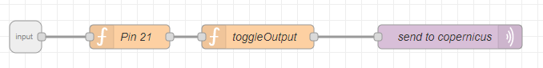

# Flows 
## Flows Smarthouse 
### Initialization flow 
Initialization flow needs to be run when a device is started. 
This flow is responsible for pins initialization. 

### Output flows 
There are three types of output flows: 
 - turn on device
 - turn off device
 - toggle device

There are three devices:
 - lamp 1
 - lamp 2
 - buzzer

Example: 
`Toggle lamp 1`
Toggle a lamp, which is connected to the pin 21. 

### Input flows 
Input flows are used to add action, that triggers an output flow. 
There are two input flows `button1` and `button2`,  which trigger an action when the button is pressed. 

## Flows Weatherforecast
### Output flows
#### Wheater forecast init
This flow is responsible for initialization of the pins in the weather forecast device. 

#### Servo
This flow is responsible for setting an appropriate angle of a servo. 

### Input flows
#### Button flows
There are two button flows. 
- `Button 1 is pressed` triggers an action when button 1 is pressed.
- `Button 2 is pressed`  triggers an action when button 2 is pressed

